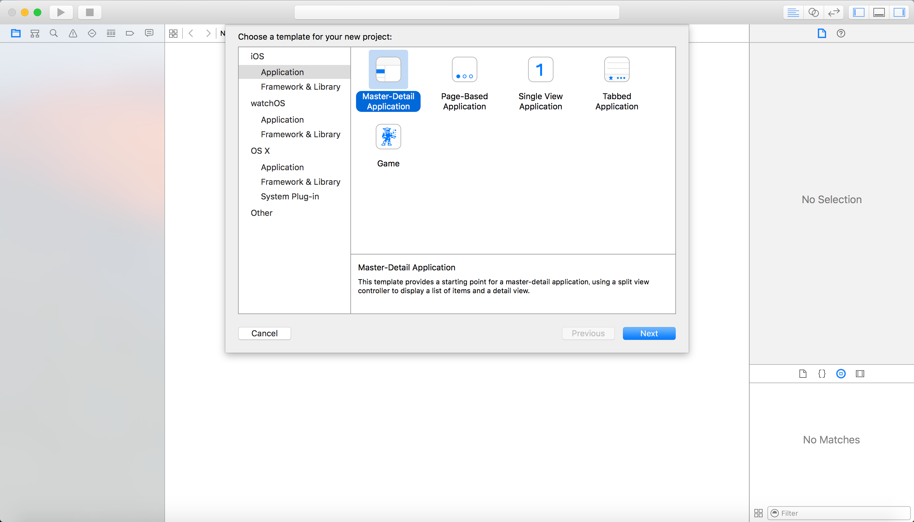
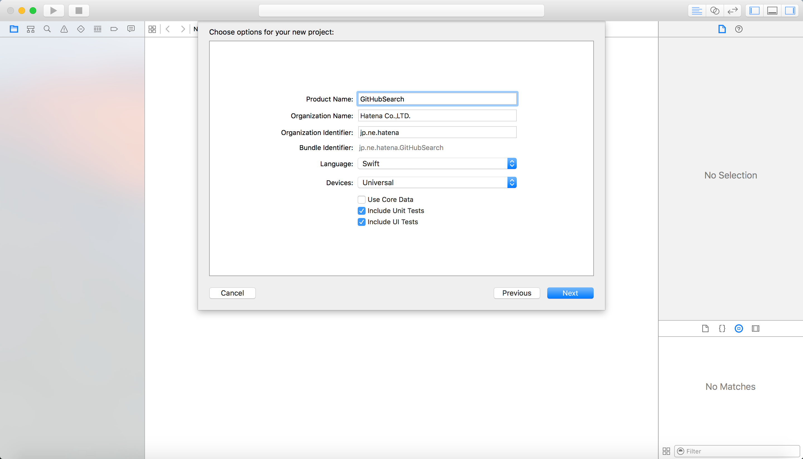
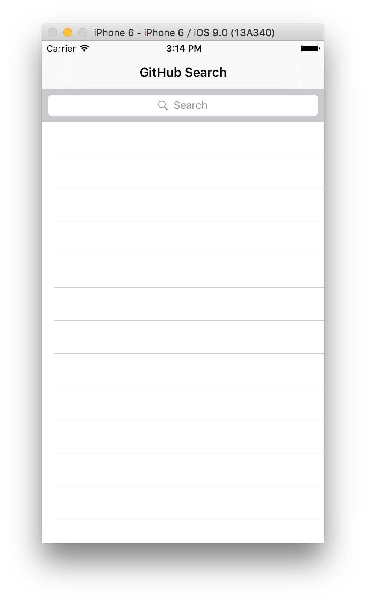

# Swift での iOS アプリ開発

プログラミング言語 Swift で iOS アプリを作る。iOS アプリは Apple が整備する Cocoa Touch と呼ばれるフレームワーク群を利用して構成される。Cocoa Touch の主要なフレームワークは `Foundation` と `UIKit` である。`Foundation` は文字列やコレクションといった基本的なクラスから、並行処理やネットワーク処理のためのクラスまで、基本的なツールが揃っている。また `Foundation` は iOS だけでなく、macOS や watchOS そして tvOS においても主要なフレームワークである。 `UIKit` は iOS の GUI フレームワークであり、アプリケーションを構成するための重要な機能のほとんどを担っている。GUI フレームワークはプラットフォーム毎に異なるものが用意されており、macOS では `AppKit`、watchOS では `WatchKit` を用いる。ただし tvOS においては `UIKit` の多くがそのまま利用でき、加えて `TVMLKit` というサーバーから配信されたマークアップ言語で GUI を構築できる仕組みも備えている。

## アーキテクチャ

はじめにアプリ全体をどのように構成するか検討する。iOS の `UIKit` フレームワークも一般的な MVC の考え方を踏襲しているが、_view controller_ が非常に大きな役割を果たす。

### View Controller

View controller は `UIViewController` のサブクラスで、自身が管理するひとつの view (`UIView`) を持つ。View controller は管理下の view を更新し、また view において発生したイベントを受け取ってハンドリングする。必要に応じて model を変更したり、あるいは model の状態を view に反映させたりする。

View controller は複数の child view controller を持つことができる。そのような child view controller を持つような view controller を container view controller と呼ぶ。アプリの画面はひとつ以上の view controller で構成され、`UIWindow` が持つひとつの `rootViewController` の下に、必要に応じて複数の view controller が重なり、あるいは遷移して、アプリの機能を提供する。つまり view controller は UI の中心となるコンポーネントである。

View controller の様々な機能については “[View Controller Programming Guide for iOS](https://developer.apple.com/library/ios/featuredarticles/ViewControllerPGforiPhoneOS/)” を参照すること。

- [UIViewController Class Reference](https://developer.apple.com/library/ios/documentation/UIKit/Reference/UIViewController_Class/)
- [UIWindow Class Reference](https://developer.apple.com/library/ios/documentation/UIKit/Reference/UIWindow_Class/index.html)

### View

View は画面の表示を司るコンポーネントである。iOS アプリにおいては `UIView` とそのサブクラスにあたる。View は複数の subview を内包することができ、view を重なり合わせて画面をつくる。アプリは原則的にひとつのウインドウ (`UIWindow`) を持ち、その上に必要な view をいくつも載せていく。

View には view controller によって直接的に管理されるものと、その subview として表示されるだけの view controller と対応しない view がある。そのような view controller や view の階層によってアプリの画面は構築されている。

```
┌──────────UIWindow──────────┐
│ ┌─────────UIView───────────┴┐     ┏━━━━━━━━━━━━━━━━━━━━━━━━━━━━┓
│ │                           │     ┃                            ┃
│ │                           │     ┃      UIViewController      ┃
│ │                           ◀─────┃   (root view controlelr)   ┃──┐
│ │                           │     ┃                            ┃  │
│ │                           │     ┗━━━━━━━━━━━━━━━━━━━━━━━━━━━━┛  │
│ │ ┌─────────UIView──────────┴─┐   ┏━━━━━━━━━━━━━━━━━━━━━━━━━━━━┓  │
│ │ │                           │   ┃                            ┃  │
│ │ │                           │   ┃      UIViewController      ┃  │
│ │ │ ┌───UILabel───┐           ◀───┃  (child view controlelr)   ┃◀─┘
│ │ │ └─────────────┘           │   ┃                            ┃
│ │ │ ┌─UIImageView─┐           │   ┗━━━━━━━━━━━━━━━━━━━━━━━━━━━━┛
│ │ │ │             │           │
│ │ │ │             │           │
│ │ │ │             │           │
│ │ │ │             │           │
│ │ │ └─────────────┘           │
│ │ │                           │
│ │ │                           │
│ │ │                           │
│ │ │                           │
│ │ │                           │
│ │ │                           │
│ │ │                           │
│ │ │                           │
│ │ │                           │
│ │ │                           │
│ │ │                           │
└─┤ │                           │
  └─┤                           │
    └───────────────────────────┘
```

View に関する様々なトピックは “[View Programming Guide for iOS](https://developer.apple.com/library/ios/documentation/WindowsViews/Conceptual/ViewPG_iPhoneOS/)” に詳しい。

- [UIView Class Reference](https://developer.apple.com/library/ios/documentation/UIKit/Reference/UIView_Class/)

#### UIKit

`UIKit` フレームワークは、iOS のユーザーインターフェイスを作るために重要な機能のほとんどを提供している。`UIKit` を学ぶことは、すなわち iOS アプリの開発を学ぶことである。

UIKit の提供する UI コンポーネントは Apple の “[UIKit User Interface Catalog](https://developer.apple.com/library/content/documentation/UserExperience/Conceptual/UIKitUICatalog/index.html)” にまとめられている。

### Model

Model はアプリケーションの中心を成す、主としてビジネスロジックを担う部分である。データやリソースを抽象化したデータモデルとしての役割も持つ。基本的にはほとんどのロジックはここに集約されるべきであり、また単体テストがしやすいコンポーネントである。

Model の役割は広く、必要に応じてより細分化された名前で呼ぶことになるかもしれない。しかし以下では view や view controller に相当するもの以外のほとんどすべてを、単に model であるとみなす。

## チュートリアル:『GitHubSearch』アプリを作る

ここから、実際に Swift 言語で iOS アプリを作ってみる。Web API から情報を取得して一覧表示する。例として GitHub の検索 API をとりあげ、GitHub のリポジトリを検索できるアプリを作ってみる。

完成したサンプルコードを GitHub で公開しているので、適宜参照すること。

https://github.com/hatena/swift-sample-GitHubSearch-2016

### プロジェクト作成

Xcode から新しくプロジェクトを作る。



テンプレートの選択を求められるので、今回は _Master-Detail Application_ を選んで Next。



適当なディレクトリを選択して保存する。


ここで `.gitignore` を適切に設定し、`git init` しておく。[GitHub の `.gitignore`](https://github.com/github/gitignore/blob/master/Swift.gitignore) をコピーするのがよい。


### Build

アプリを build するとソースコードがコンパイルされる。Xcode 左上の Run を押すことで、build して選択したターゲットデバイスでアプリを起動できる。



Run するとデバッグ用の build が行われ（最適化が省略されたり、開発用のバイナリになる）、自動的にデバッガーが接続される。止めるときは Xcode 左上の Stop を押す。

アプリの開発中はこのような工程を何度も行って、少しずつアプリを作る。必要に応じて iOS Simulator や USB で接続された iOS の実機をターゲットデバイスとして選ぶ。

### View Controller 作成と Storyboard

アプリの UI は Storyboard ファイルを使って作る。Storyboard は Xcode の Interface Builder 機能を用いてグラフィカルに編集可能である。Storyboard 上には scene と呼ばれる view と view controller の組が並べられ、その view を編集して UI を作る。また view controller 同士を segue (`UIStoryboardSegue`) と呼ばれる線で繋ぐことで、画面の遷移などを表現する。

まずは最初から追加されている `Main.storyboard` ファイルを開く。すでにいくつかの scene が追加されているが、`UISplitViewController` や `UINavigationController` から接続された `MasterViewController`と `DetailViewController` のふたつの view controller が主な興味の対象である。

- [UIStoryboard Class Reference](https://developer.apple.com/library/ios/documentation/UIKit/Reference/UIStoryboard_Class/)
- [UIStoryboardSegue Class Reference](https://developer.apple.com/library/ios/documentation/UIKit/Reference/UIStoryboardSegue_Class/)

#### Container View Controller

Child view controller を持つような view controller を _container view controller_ と言う。View controller の階層を作ることで、遷移元と遷移先の view controller を入れ替えることで画面遷移させられるほか、一つの画面を複数の view controller に分割することもできる。

`UISplitViewController` は画面幅が広い場合に、ナビゲーションを表示する view controller と詳細を表示する view controller を左右に並べて表示するための container view controller である。画面のサイズに応じて最適な UI に切り替えることを、iOS では adaptive という単語で表現している。`UINavigationController` は、スタック様に行き来する画面遷移を含んだナビゲーションのための container view controller である。上部の `UINavigationBar` を用いて一つ前の view controller に戻ることができる。

このように UIKit には様々な container view controller が用意されており、それぞれ役割を持っている。

- [UINavigationController Class Reference](https://developer.apple.com/library/ios/documentation/UIKit/Reference/UINavigationController_Class/)
- [UISplitViewController Class Reference](https://developer.apple.com/library/ios/documentation/UIKit/Reference/UISplitViewController_class/)

最初から Storyboard に配置されているこれらの view controller は、そのまま利用する。

#### Scene

`MasterViewController` は `UITableViewController` のサブクラスで、 `UITableView` による一覧表示を管理する view controller となる。今回のアプリでは最初の画面となり、GitHub のリポジトリ一覧を表示することになる。`DetailViewController` は通常の `UIViewController` のサブクラスで、リポジトリの詳細を表示する画面になる予定である。

Interface Builder の右側のインスペクタは、選択中の要素の詳細を変更できる。_Identifier Inspector_ タブから _Custom Class_ の設定を確認することで、それぞれの scene に設定された view controller を確かめることができる。


#### Storyboard

_Attributes Inspector_ タブで view controller の _Is Initial View Controller_ にチェックが入っている scene が、その Storyboard における最初の画面である。`Main.storyboard` はアプリの _Main Storyboard file_ なので（`Info.plist` ファイルで設定できる）、この Storyboard における最初の画面はアプリにとっても最初の画面である。

Scene と scene を繋ぐ segue には、大きく分けて二つの種類がある。一つは `UINavigationController` から繋がる _root view controller_ などの _relationship segue_ である。これは view controller 同士の関係性を定めるものであり、特定の種類の view controller からしか繋げられない。もう一つは画面の遷移を表現する segue で、_Show_, _Show Detail_, _Present Modally_, _Present as Popover_ などの _Kind_ が選べる。遷移の segue は、遷移元となる view controller そのものから設定されるものや、配置された button (`UIButton`) などから設定されるものがある。Button などから設定された segue は自動的に機能するが、view controller から設定された segue は `performSegueWithIdentifier(_:sender:)` メソッドを呼び出さなければならない。また segue には _Identifier_ があり、_Kind_ などとともに _Attributes Inspector_ から設定できる。

Storyboard 上の要素に Swift からアクセスしたい場合は、`@IBOutlet` を利用する。View controller に `@IBOutet` 属性を指定したインスタンス変数を定義し、Interface Builder で副ボタンクリック（右クリック）やドラッグアンドドロップして要素と接続する。同様に button (`UIButton`) などが引き起こす動作を設定するには、`@IBAction` 属性を指定したメソッドを view controller に定義して、接続する。

Storyboard 上に要素を配置するには、右下の _Object library_ から必要なパーツを選ぶ。Segue や `@IBAction`, `@IBOutlet` などは、副ボタンクリック（右クリック）やドラッグアンドドロップによって設定できる。

### API とネットワーク通信

ここから [GitHub のリポジトリ検索 API](https://developer.github.com/v3/search/#search-repositories) を利用する。

`https://api.github.com/search/repositories?q=Hatena&page=1` というような URL で以下のような JSON を返す。

```json5
{
  "total_count": 583,
  "incomplete_results": false,
  "items": [
    {
      "id": 3946028,
      "name": "Hatena-Textbook",
      "full_name": "hatena/Hatena-Textbook",
      "owner": {
        "login": "hatena",
        "id": 14185,
        "avatar_url": "https://avatars.githubusercontent.com/u/14185?v=3",
        "gravatar_id": "",
        "url": "https://api.github.com/users/hatena",
        "html_url": "https://github.com/hatena",
        "type": "Organization"
      },
      "private": false,
      "html_url": "https://github.com/hatena/Hatena-Textbook",
      "description": "はてな研修用教科書",
      "fork": false,
      "url": "https://api.github.com/repos/hatena/Hatena-Textbook",
      "created_at": "2012-04-06T02:04:23Z",
      "updated_at": "2015-08-02T04:44:15Z",
      "pushed_at": "2015-02-26T06:30:33Z",
      "homepage": "",
      "size": 614,
      "stargazers_count": 879,
      "watchers_count": 879,
      "language": null,
      "forks_count": 72,
      "open_issues_count": 2,
      "forks": 72,
      "watchers": 879,
      "default_branch": "master",
      "score": 36.982796
    },
    ...
  ]
}

```

iOS アプリからの HTTP 通信では、`NSURLRequest` を `NSURLSession` を介して送信してレスポンスを得る。レスポンスは `NSURLResponse` かそのサブクラスの `NSHTTPURLResponse` で、レスポンスデータはバイナリの `NSData` である。`NSJSONSerialization` を利用することでバイナリから JSON の内容を得られる。 これらは全て Foundation.framework が提供する機能である。これを実際に行うのは以下のようなコードになる。

```swift
import Foundation

let URL = NSURL(string: "https://api.github.com/search/repositories?q=Hatena&page=1")!

let request = NSMutableURLRequest(URL: URL)
request.HTTPMethod = "GET"
request.addValue("application/vnd.github.v3+json", forHTTPHeaderField: "Accept")

let task = NSURLSession.sharedSession().dataTaskWithRequest(request) { (data, response, error) in
    if let error = error {
        print(error)
    }

    if let data = data {
        print(try? NSJSONSerialization.JSONObjectWithData(data, options: []) as? [String: AnyObject])
    }
}

task.resume()
```

`NSMutableURLRequest` を用いてリクエストを構築し、`NSURLSession` から `NSURLSessionDataTask` を作る。通信の結果は `completionHandler` のクロージャに渡され、バイナリの `NSData` から `NSJSONSerialization` で Foundation のオブジェクトにできる。

- [NSURL Class Reference](https://developer.apple.com/library/ios/documentation/Cocoa/Reference/Foundation/Classes/NSURL_Class/)
- [NSURLRequest Class Reference](https://developer.apple.com/library/ios/documentation/Cocoa/Reference/Foundation/Classes/NSURLRequest_Class/)
- [NSURLResponse Class Reference](https://developer.apple.com/library/ios/documentation/Cocoa/Reference/Foundation/Classes/NSURLResponse_Class/)
- [NSURLSession Class Reference](https://developer.apple.com/library/ios/documentation/Foundation/Reference/NSURLSession_class/)
- [NSURLSessionDataTask Class Reference](https://developer.apple.com/library/ios/documentation/Foundation/Reference/NSURLSessionDataTask_class/index.html)
- [NSJSONSerialization Class Reference](https://developer.apple.com/library/ios/documentation/Foundation/Reference/NSJSONSerialization_Class/)

この API の場合は、前述した JSON のオブジェクトが返ってくるはずなので、`[String: AnyObject]` 型の辞書を取り出すことができる。ここから、検索結果の個々のアイテムの名前を取得すると、以下のようになる。

```swift
let data: NSData!

var JSON: [String: AnyObject]?
do {
    JSON = try NSJSONSerialization.JSONObjectWithData(data, options: []) as? [String: AnyObject]
} catch {
    print(error)
}
if let JSON = JSON {
    if let items = JSON["items"] as? [AnyObject] {
        for case let item as [String: AnyObject] in items {
            if let name = item["name"] as? String {
                print(name)
            }
        }
    }
}
```

見ての通り、型を確かめるためのコードが続くことになる。これでは使いにくいので、モデルオブジェクトとマッピングしていくことを検討する。

#### JSON のモデル

それぞれの API から返ってくる JSON のフォーマットは常に一貫している。このデータ構造を Swift の struct にすることを考える。この API から返ってくるデータの構造を簡略化すると以下のようになり、全体を覆う JSON のオブジェクトがあり、その `items` キーの内部に repository を表す JSON オブジェクトの配列があり、repository の `owner` キーには user を表す JSON オブジェクトがある。それ以外のキーは、文字列や数値、真偽値などのプリミティブな値である。

```json5
{
  // Search result
  "items": [
    {
      // Repository
      "owner": {
        // User
        ...
      },
      ...
    },
    ...
  ],
  ...
}
```

これらは、`SearchResult`, `Repository`, `User` の3つの型で表現できる。はじめに、いちばん簡単な `User` 部分について見てみる。JSON のオブジェクトは以下のようになっている。

```json5
{
  "login": "hatena",
  "id": 14185,
  "avatar_url": "https://avatars.githubusercontent.com/u/14185?v=3",
  "gravatar_id": "",
  "url": "https://api.github.com/users/hatena",
  "html_url": "https://github.com/hatena",
  "type": "Organization"
}
```

Swift の struct でこれを表すと以下のようになる。

```swift
struct User {
    let login: String
    let id: Int
    let avatarURL: NSURL
    let gravatarID: String
    let URL: NSURL
    let receivedEventsURL: NSURL
    let type: String
}
```

ここに `init?(JSON: [String: AnyObject])` のようなイニシャライザをつけると、以下のようにできる。

```swift
init?(JSON: [String: AnyObject]) {
    guard
        let login = JSON["login"] as? String,
        let id = JSON["id"] as? Int,
        let avatarURL = (JSON["avatar_url"] as? String).flatMap(NSURL.init(string:)),
        let gravatarID = JSON["gravatar_id"] as? String,
        let URL = (JSON["url"] as? String).flatMap(NSURL.init(string:)),
        let receivedEventsURL = (JSON["received_events_url"] as? String).flatMap(NSURL.init(string:)),
        let type = JSON["type"] as? String
    else {
        return nil
    }
    self.login = login
    self.id = id
    self.avatarURL = avatarURL
    self.gravatarID = gravatarID
    self.URL = URL
    self.receivedEventsURL = receivedEventsURL
    self.type = type
}
```

これで作られた `User` 型のインスタンスは完全に型付けされており、安全である。

同様のことを `SearchResult` や `Repository` でも行うとよいが、些か冗長ではある。要するに個々のキーに対して正しい型の値が入っていることが保障されればよいので、これを簡単にするユーティリティを作る。

```swift
enum JSONDecodeError: ErrorType {
    case MissingRequiredKey(String)
    case UnexpectedType(key: String, expected: Any.Type, actual: Any.Type)
}

struct JSONObject {

    let JSON: [String: AnyObject]

    func get<T>(key: String) throws -> T {
        guard let value = JSON[key] else {
            throw JSONDecodeError.MissingRequiredKey(key)
        }
        guard let typedValue = value as? T else {
            throw JSONDecodeError.UnexpectedType(key: key, expected: T, actual: value.dynamicType)
        }
        return typedValue
    }

}

```

これは、JSON オブジェクトの `[String: AnyObject]` から初期化できる struct で、`get<T>(_:) throws -> T` というメソッドを持っている。型パラメータ `T` があるとき、特定のキーについて値が存在し、それが `T` 型であることを保障する。値が存在しなかったり型が異なっている場合にはエラーを投げる。これを用いると、`User` の新たなイニシャライザ `init(JSON: JSONObject) throws` は以下のように書ける。

```swift
init(JSON: JSONObject) throws {
    self.login = try JSON.get("login")
    self.id = try JSON.get("id")
    self.avatarURL = NSURL(string: try JSON.get("avatar_url"))!
    self.gravatarID = try JSON.get("gravatar_id")
    self.URL = NSURL(string: try JSON.get("url"))!
    self.receivedEventsURL = NSURL(string: try JSON.get("received_events_url"))!
    self.type = try JSON.get("type")
}
```

型パラメータ `T` はコンテキストから推論できるので書く必要がない。こうすることで記述が簡略化され、さらに失敗した場合にその原因を調べることが容易になる。

もし存在しなくてもよい property がある場合は、その型を `Optional` にしておく。そして `JSONObject` に以下のメソッドを付け足す。

```swift
func get<T>(key: String) throws -> T? {
    guard let value = JSON[key] else {
        return nil
    }
    if value is NSNull {
        return nil
    }
    guard let typedValue = value as? T else {
        throw JSONDecodeError.UnexpectedType(key: key, expected: T, actual: value.dynamicType)
    }
    return typedValue
}
```

キーが存在しないか、値が `NSNull` の場合にエラーを投げず、そのまま `nil` 値を返している。このため返り値の型は `T?` である。この場合、先ほどの `get<T>(_:) throws -> T` といま作った `get<T>(_:) throws -> T?` は、返り値が `T` か `T?` かの違いしかない。Swift のオーバーロード機能によって、呼び出すコンテキストから適切な方が選択される。

これらの機能を利用し、またはさらに拡張することで、JSON オブジェクトからそれぞれ何らかの型にマッピングしたオブジェクトが得られるはずである。

#### Web API の抽象化

レスポンスの抽象化ができたところで、次は Web API について検討する。最初に HTTP 通信した際には、`NSURLRequest` や `NSURLSession` をその場で作成していた。ふつうアプリが利用する Web API は多岐に渡るので、毎度このような書き方をしているといかにも冗長だ。

一般的な Web API では、エンドポイント毎にリクエストとレスポンスのフォーマットが決まっている。ここでいうエンドポイントというのは、API の URL と HTTP メソッドの組を指す。これをモデリングすると、以下のようにできる。

```swift
protocol JSONDecodable {
    init(JSON: JSONObject) throws
}

enum HTTPMethod: String {
    case OPTIONS
    case GET
    case HEAD
    case POST
    case PUT
    case DELETE
    case TRACE
    case CONNECT
}

protocol APIEndpoint {
    var URL: NSURL { get }
    var method: HTTPMethod { get }
    var query: [String: String]? { get }
    var headers: [String: String]? { get }
    associatedtype ResponseType: JSONDecodable
}

extension APIEndpoint {
    var method: HTTPMethod {
        return .GET
    }
    var query: [String: String]? {
        return nil
    }
    var headers: [String: String]? {
        return nil
    }
}
```

`APIEndpoint` protocol は、Web API のエンドポイントを抽象化している。リクエスト先の URL と HTTP メソッドを持ち、またレスポンスの型を associated type として持つ。レスポンスは `JSONObject` から初期化できるように、`JSONDecodable` protocol を新たに用意した。先ほどの JSON のモデルオブジェクトは容易に準拠できる。またデフォルト値を指定しても問題ないようなものには protocol extension でデフォルトを与えた。これらを用いれば、`NSURLRequest` を作るのも用意である。

```swift
extension APIEndpoint {
    var URLRequest: NSURLRequest {
        let components = NSURLComponents(URL: URL, resolvingAgainstBaseURL: true)
        components?.queryItems = query?.map(NSURLQueryItem.init)

        let req = NSMutableURLRequest(URL: components?.URL ?? URL)
        req.HTTPMethod = method.rawValue
        for (key, value) in headers ?? [:] {
            req.addValue(value, forHTTPHeaderField: key)
        }

        return req
    }
}
```

`NSURLComponents` や `NSURLQueryItem` を利用することで、URL を作るのが簡単になる。

- [NSURLComponents Class Reference](https://developer.apple.com/library/ios/documentation/Foundation/Reference/NSURLComponents_class/)
- [NSURLQueryItem Class Reference](https://developer.apple.com/library/ios/documentation/Foundation/Reference/NSURLQueryItem_Class/)

ここまでくれば、リクエストを送るのも簡単である。

```swift
enum APIError: ErrorType {
    case EmptyBody
    case UnexpectedResponseType
}

enum APIResult<Response> {
    case Success(Response)
    case Failure(ErrorType)
}

extension APIEndpoint {
    func request(session: NSURLSession, callback: (APIResult<ResponseType>) -> Void) -> NSURLSessionDataTask {
        let task = session.dataTaskWithRequest(URLRequest) { (data, response, error) in
            if let e = error {
                callback(.Failure(e))
            } else if let data = data {
                do {
                    guard let dic = try NSJSONSerialization.JSONObjectWithData(data, options: []) as? [String: AnyObject] else {
                        throw APIError.UnexpectedResponseType
                    }
                    let response = try ResponseType(JSON: JSONObject(JSON: dic))
                    callback(.Success(response))
                } catch {
                    callback(.Failure(error))
                }
            } else {
                callback(.Failure(APIError.EmptyBody))
            }
        }
        task.resume()
        return task
    }
}
```

基本的には `NSURLSession` を利用しているだけだが、associated type の `ResponseType` を利用してレスポンスの型を決定している。また callback には `APIResult` enum を使うことで、成功か失敗かの2値で表現できる。

これで一般的な Web API との通信が書けるようになったが、今回は GitHub の API のためにさらに特殊化することを考える。

```swift
protocol GitHubEndpoint: APIEndpoint {
    var path: String { get }
}

private let GitHubURL = NSURL(string: "https://api.github.com/")!

extension GitHubEndpoint {
    var URL: NSURL {
        return NSURL(string: path, relativeToURL: GitHubURL)!
    }
    var headers: [String: String]? {
        return [
            "Accept": "application/vnd.github.v3+json",
        ]
    }
}
```

GitHub の API は URL を `https://api.github.com/` 以下に限定できる。これを利用して、`APIEndpoint` protocol を継承した `GitHubEndpoint` protocol を作成する。これは `var URL: NSURL { get }` にデフォルト実装を与え、新たな `var path: String { get }` property から URL を生成する。さらにここでは HTTP ヘッダーにもデフォルト実装を加えた。

これらを活用すると、リポジトリの検索 API は以下のようにできる。

```swift
struct SearchRepositories: GitHubEndpoint {
    var path = "search/repositories"
    var query: [String: String]? {
        return [
            "q"    : searchQuery,
            "page" : String(page),
        ]
    }
    typealias ResponseType = SearchResult<Repository>

    let searchQuery: String
    let page: Int
    init(searchQuery: String, page: Int) {
        self.searchQuery = searchQuery
        self.page = page
    }
}
```

これは `GitHubEndpint` protocol と `APIEndpoint` protocol に準拠する。利用するのも非常に簡単で、以下のように書くだけでよい。

```swift
SearchRepositories(searchQuery: "Hatena", page: 0).request(NSURLSession.sharedSession()) { (result) in
    switch result {
    case .Success(let searchResult):
        print(searchResult)
    case .Failure(let error):
        print(error)
    }
}
```

### `UITableView`

ここで検索結果を表示する画面を作っていく。`UITableViewController` のサブクラス `MasterViewController` を開く。テンプレート的な実装が書いてあるが、不要なところは消しておく。

`UITableView` への表示は、`UITableViewDataSource` と `UITableViewDelegate` のふたつのデリゲートを実装することで行う。iOS アプリの実装ではこのようなデリゲートパターンを多用する。

`protocol UITableViewDataSource` は、`UITableView` に表示する内容を提供するためのものである。必ず実装しなければならないふたつのメソッドがあり、`func tableView(_:numberOfRowsInSection:)` は行数を返し、`func tableView(_:cellForRowAtIndexPath:)` においてそれぞれの行 (Cell) を返す。

`protocol UITableViewDelegate` は内容を提供する以外の様々な役割を果たす。例えば特定の行がこれから表示されることを伝える `func tableView(_:willDisplayCell:forRowAtIndexPath:)` などがある。

`UITableViewController` では、表示される `UItableView` の二つのデリゲートは view controller 自身になる。`MasterViewController` でもこれらを実装していく。

まずは表示するデータの元となる配列を property `var repositories: [Repository] = []` として用意する。このとき、配列の内容に変化があったら `UITableView` をリロードしたいので、property observer を設定しておく。

```swift
var repositories: [Repository] = [] {
    didSet {
        tableView.reloadData()
    }
}
```

これを元にして `UITableViewDataSource` の必須のメソッドを実装する。

```swift
override func tableView(tableView: UITableView, numberOfRowsInSection section: Int) -> Int {
    return repositories.count
}

override func tableView(tableView: UITableView, cellForRowAtIndexPath indexPath: NSIndexPath) -> UITableViewCell {
    let cell = tableView.dequeueReusableCellWithIdentifier("Cell", forIndexPath: indexPath)
    let repository = repositories[indexPath.row]
    cell.textLabel?.text = repository.name
    return cell
}
```

行数は配列の `count` と一致するはずである。また `UITableViewCell` は、パフォーマンスのために `UITableView` の中で再利用される。`dequeueReusableCellWithIdentifier(_:forIndexPath:)` で、`UITableView` から再利用するための `UITableViewCell` を取得する。このとき、identifier 引数と一致する reuse identifier の `UITableViewCell` を事前に `UITableView` に登録しておく必要がある。いくつかの方法があるが、Storyboard 上で設定しておくのが簡単である。

- [UITableView Class Reference](https://developer.apple.com/library/ios/documentation/UIKit/Reference/UITableView_Class/)
- [UITableViewCell Class Reference](https://developer.apple.com/library/ios/documentation/UIKit/Reference/UITableViewCell_Class/)
- [UITableViewDelegate Protocol Reference](https://developer.apple.com/library/ios/documentation/UIKit/Reference/UITableViewDelegate_Protocol/)
- [UITableViewDataSource Protocol Reference](https://developer.apple.com/library/ios/documentation/UIKit/Reference/UITableViewDataSource_Protocol/)
- [UITableViewController Class Reference](https://developer.apple.com/library/ios/documentation/UIKit/Reference/UITableViewController_Class/)

このような実装があれば、後は `var repositories: [Repository]` プロパティを操作するだけでよい。ここでは `viewDidLoad()` メソッドの中で API からリポジトリ一覧を取得する。

```swift
override func viewDidLoad() {
    super.viewDidLoad()

    SearchRepositories(searchQuery: "Hatena", page: 0).request(NSURLSession.sharedSession()) { (result) in
        switch result {
        case .Success(let searchResult):
            dispatch_async(dispatch_get_main_queue()) {
                self.repositories.appendContentsOf(searchResult.items)
            }
        case .Failure(let error):
            print(error)
        }
    }

    // 残りの処理
}
```

コールバックの中で `dispatch_async` 関数を利用している。ネットワーク通信は非同期に行われメインスレッドでは処理しない一方で、ユーザーインターフェイスは必ずメインスレッドから操作しなければならない。これは GUI システムの多くに存在する制約である。ここで利用している `dispatch_async` や `dispatch_get_main_queue` 関数は、GCD (_Grand Central Dispatch_) と呼ばれるものの一部である。GCD は内部にスレッドプールを持ち、キューとタスクの概念によって粒度の小さいタスクでも効率的に並列実行できるようになっている。今回は単にメインスレッドで処理したいだけなので、メインスレッドと紐付けられた main queue を取得し、そこで実行するようにしている。

- [Grand Central Dispatch \(GCD\) Reference](https://developer.apple.com/library/ios/documentation/Performance/Reference/GCD_libdispatch_Ref/)

### View Controller のライフサイクル

Web API と通信する際、`viewDidLoad()` メソッドを利用した。これは view controller のライフサイクルメソッドの一つである。View controller にはライフサイクルが存在し、生成されて表示され、さらに非表示になるまで、いくつもの段階を追うことができる。このライフサイクルに合わせて処理を行うことが非常に重要である。

よく使われるライフサイクルメソッドは以下のようなものである。

- `loadView()`
- `viewDidLoad()`
- `viewWillAppear(_:)`
- `viewDidAppear(_:)`
- `viewWillDisappear(_:)`
- `viewDidDisappear(_:)`

`loadView()` は `UIViewController` の `var view: UIView!` property が `nil` のとき、`view` にアクセスすると呼び出される。デフォルトでは `view` property に空の `UIView` のインスタンスをセットする。また Storyboard などを利用していれば、紐付けられた view が読み込まれる。このメソッドを override して、独自の view を読み込むようにしてもよい。`UITableViewController` の場合はここで `UITableView` のインスタンスがセットされている。こうして `view` が読み込まれると、次に `viewDidLoad()` が呼び出される。この時点で view が生成されていることが保障されるので、これを前提とした追加の処理を行うことができる。

`viewWillAppear(_:)` や `viewDidAppear(_:)` は画面上に view が表示される前後にそれぞれ呼び出される。同様に `viewWillDisappear(_:)` や `viewDidDisappear(_:)` は view が画面上から消える前後に呼び出される。画面の表示に関する処理は、これらのメソッドを override して実装することになる。

### 画面遷移

Cell が選択されたら画面遷移をして、詳細が表示されるようにする。詳細画面は `DetailViewController` を利用する。テンプレートではすでに、cell が選択されたら詳細画面が表示されるようになっている。これは、cell から _Show Detail_ Segue が伸びて view controller と接続されているためである。

このままでも画面の遷移はできているが、どの cell が選択され、選択された cell が表していた `Repository` は何なのかが詳細画面に伝わっていない。`prepareForSegue(_:sender:)` メソッドを override して、遷移先の画面に情報を渡すことができる。

```swift
override func prepareForSegue(segue: UIStoryboardSegue, sender: AnyObject?) {
    if segue.identifier == "showDetail" {
        if let indexPath = tableView.indexPathForSelectedRow {
            let repository = repositories[indexPath.row]
            let controller = (segue.destinationViewController as! UINavigationController).topViewController as! DetailViewController
            controller.repository = repository
        }
    }
}
```

Storyboard で設定された segue の identifier に合わせて処理を行うことができる。

遷移先の view controller である `DetailViewController` では `Repository` のデータを表示する。

```swift
class DetailViewController: UIViewController {

    @IBOutlet weak var detailDescriptionLabel: UILabel!

    var repository: Repository? {
        didSet {
            configureView()
        }
    }

    private func configureView() {
        if let repository = repository {
            if let label = detailDescriptionLabel {
                label.text = repository.name
            }
        }
    }

    override func viewDidLoad() {
        super.viewDidLoad()

        configureView()
    }

}
```

最初に `@IBOutlet` 属性が付加された `detailDescriptionLabel` property がある。これは view が読み込まれる際に、Storyboard で設定した `UILabel` が自動的に接続される。このような設定は Interface Builder 上で行うことができる。View が読み込まれる前は `nil` 値になっているので注意する必要がある。

`@IBOutlet` と同様に、`@IBAction` 属性を付けたメソッドは Interface Builder から参照できる。`UIButton` などの `UIControl` オブジェクトから、`UIControlEvents.TouchUpInside` などのイベントを接続し、必要な処理を行うようにすることができる。

### Target-Action パラダイムによるイベントハンドリング

UIKit における操作可能な UI 要素の多くは `UIControl` を継承している。それらは例えば `UIButton` や `UISlider` など、様々な形態を取る。これらは `UIControlEvents` を発生させ、_target-action_ パラダイムによりイベントを送信する。`UIControl` の `addTarget(_:action:forControlEvents:)` メソッドを呼び出し、イベント送信先のオブジェクト (_target_) と、メソッドへの参照である `Selector` (_action_)、送信されるべきイベントの種類である `UIControlEvents` を指定する。`Selector` はメソッドの参照を `#selector()` 式に与えることで得られる。

例えば `UIButton` なら `button.addTarget(self, action: #selector(self.buttonDidTapped(_:)), forControlEvents: .TouchUpInside)` などとすると、`func buttonDidTapped(sender: UIButton)` メソッドを呼び出させることができる。これは Interface Builder と `@IBAction` 設定できるものと同じである。

`UIControl` を継承していない view や、あるいは単純ではないジェスチャーを扱うために、`UIGestureRecognizer` を利用することもできる。`UIGestureRecognizer` の種々のサブクラスを `UIView` に `addGestureRecognizer(_:)` で追加することができ、タップやスワイプなどのジェスチャーに対する target や action を設定できる。

より低レベルなイベントをハンドリングするためには、`UIEvent` と `UIResponder` の機能を利用する。`UIView` や `UIViewController` は `UIResponder` のサブクラスである。UIKit は、例えば画面上で発生したタッチイベントを、イベントが起きた位置の view に `UIEvent` として渡す。これは `UIResponder` の `nextResponder()` を辿って、どこかでハンドリングされるまで伝播していく。`UIControl` や `UIGestureRecognizer` はこの仕組みの上で、特定のパターンを target-action で伝えてくれる。

- [UIControl Class Reference](https://developer.apple.com/library/ios/documentation/UIKit/Reference/UIControl_Class/)
- [UIGestureRecognizer Class Reference](https://developer.apple.com/library/ios/documentation/UIKit/Reference/UIGestureRecognizer_Class/)
- [UIResponder Class Reference](https://developer.apple.com/library/ios/documentation/UIKit/Reference/UIResponder_Class/)
- [UIEvent Class Reference](https://developer.apple.com/library/ios/documentation/UIKit/Reference/UIEvent_Class/)

### Auto Layout

`UIView` のレイアウトは、_Auto Layout_ と呼ばれる仕組みによって行われる。Auto Layout では、`NSLayoutConstraint` オブジェクトによって表現される制約を組み合わせることで、view のレイアウトを解決する。例えば、view の横幅や高さに関する制約や、他の view との位置関係を決める制約を作ることができる。ひとつの `NSLayoutConstraint` にはふたつの item （view など）とそれぞれの attribute （「高さ」や「水平方向の中心」、「ベースライン」など）、そして relation （等しさや大小関係）と priority が存在する。

`UIView` は `intrinsicContentSize()` メソッドで自身が表示されるべき最適なサイズを返すことができる。短い文字列を表示する `UILabel` であればちょうど文字列が収まるサイズに相当する。高さや幅に関する制約がなければ自動的にそのサイズに決まる。

`NSLayoutConstraint` には整数値で表現される `priority` があり、制約同士が矛盾する場合には大きい方から順に優先される。最大値の `1000` は、必ず充たされなければならない制約である。また `UIView` にも、`intrinsicContentSize()` より拡がらないための priority `contentHuggingPriorityForAxis(_:)` と、狭まらないための priority `contentCompressionResistancePriorityForAxis(_:)` があり、それぞれデフォルトでは `250` と `750` の値が設定されている。つまり狭まりにくく拡がりやすいようになっている。

`NSLayoutConstraint` は Interface Builder から GUI 上で設定することができるほか、イニシャライザ `init(item:attribute:relatedBy:toItem:attribute:multiplier:constant:)` や _visual format language_ で初期化できる。また `UIView` の _layout anchor_ を利用することもできる。Visual format language では、例えば `H:|-8-[view]-8-|` のような書式で、複雑な複数の制約を一度に作ることができる。Layout anchor は `NSLayoutAnchor` のインスタンスで、例えばふたつの `UIView` の `var topAnchor: NSLayoutYAxisAnchor { get }` property を使って `view1.topAnchor.constraintEqualToAnchor(view2.topAnchor)` とすると、view の上辺が揃う制約を作ることができる。

Auto Layout の詳細は Apple のドキュメント “[Auto Layout Guide](https://developer.apple.com/library/ios/documentation/UserExperience/Conceptual/AutolayoutPG/)” で説明されている。

---

# 課題

課題では、これまで作ってきた `Intern::Diary` の iOS アプリを作る。必要となる JSON API を用意し、これを利用したアプリを作成する。

## 課題

iOS アプリで日記の記事一覧を表示できるようにする。表示には `UITableView` を使うこと。また個別の記事を選択したとき、個別の記事画面に遷移するようにすること。

## 自由課題

創意工夫をしてより便利なアプリにする。

---

# 追補

## 自動テスト

Xcode でアプリを開発する際には、ふたつの方法で自動テストすることができる。プログラムの個々のモジュールが期待どおりに動作することを確かめるユニットテストと、アプリを操作して正しく動作することを確認する UI テストである。Xcode においては、これらは `XCTest` フレームワークの機能として提供される。これらの機能はプロジェクトエディタでテスト用のターゲットを追加することで利用できる。

Xcode の自動テストは、`XCTestCase` のサブクラスとして記述する。メソッド名が `test` から始まるものがテストメソッドで、`setUp()` や `tearDown()` は全てのテストメソッドの前後に実行される。テストメソッドの内部で `XCAsset` から始まる関数群を呼び出し、個々のアサーションとする。

このように自動テストは、テストケースクラスとテストメソッド、そしてアサーションを組み合わせて作られる。

### ユニットテスト

```swift
import XCTest
@testable import GitHub

class GitHubTests: XCTestCase {

    override func setUp() {
        super.setUp()
    }

    override func tearDown() {
        super.tearDown()
    }

    func testExample() {
        XCTAssertEqual(1, 1, "Message")
    }

}
```

ユニットテストでは、単にプログラムの特定の部分についてテストを行う。主に公開 API について、その振る舞いが正しいことをテストする。

テスト対象の Swift のモジュールは、テストコードとは異なるモジュールになっている。すなわち `import` する必要があり、また `public` の可視性を持ったシンボルしか参照できない。ただし `@testable import` することで `internal` の可視性を持つものを参照することができる。

### UI テスト

UI テストでは、アプリを実際に起動してから個々のアサーションを実行することになる。この場合も基本的な書き方はユニットテストと同じである。まずは `setUp()` でアプリを起動する。UI テストでは `XCUI` から始まるクラスが利用できる。

```swift
override func setUp() {
    super.setUp()

    continueAfterFailure = false
    XCUIApplication().launch()
}
```

テストメソッドでは、UI を操作してその結果が正しいことをアサーションしていくことになる。UI を操作するコードは一般に煩雑であり、手で書くのは比較的難しいので、Xcode では人間の操作を記録することができるようになっている。

Xcode のテストについては “[Abount Testing with Xcode](https://developer.apple.com/library/ios/documentation/DeveloperTools/Conceptual/testing_with_xcode/chapters/01-introduction.html)” が詳しい。

## デバッグ

iOS/macOS プログラミングにおけるデバッグの手法を簡単に紹介する。

### `print`

ログを出してデバッグする。原始的な方法ではあるが柔軟でもある。

```swift
let dict = [ "a" : "b" ]
print("Dictionary: \(dict)")
```

必要に応じて `CustomStringConvertible` などを実装しておくとよい。

### デバッガとブレークポイント

ブレークポイントを設定することで、実行中のプログラムを特定の位置で止めることができる。Xcode から GUI でブレークポイントを操作できる。


例外発生時に止まるブレークポイントを設定することができ、例外の原因を辿りやすくなる。

デバッガについては “[Debugging with Xcode](https://developer.apple.com/library/ios/documentation/DeveloperTools/Conceptual/debugging_with_xcode/)” が詳しい。

### Instruments

Xcode に付属する Instruments を使うと、さらに高度な解析が簡単に行える。メモリリークの発見やパフォーマンスのチューニングなど、様々に利用できる。詳しくは “[Instruments User Guide](https://developer.apple.com/library/ios/documentation/DeveloperTools/Conceptual/InstrumentsUserGuide/)” を参照すること。

## 依存ライブラリ管理

ライブラリを利用する際にはいくつかの方法がある。ここでは CocoaPods や Carthage を紹介する。

### CocoaPods

[CocoaPods](http://cocoapods.org/) はコミュニティによって開発されている Ruby 製のツールである。下記のような `Gemfile` を置いて `bundle install` する。以降は `bundle exec pod` で `pod` コマンドを利用する。

```ruby
source 'https://rubygems.org'
gem 'cocoapods'
```

`bundle exec pod init` すると空の `Podfile` ができる。ここに必要なライブラリを書く。テストにだけ必要なライブラリなどは target 毎に書くとよい。

```ruby
platform :ios, '9.0'

use_frameworks!

pod 'AFNetworking'
```

Podfile を保存したらそのディレクトリで `bundle exec pod install` する。

ここで一度 Xcode のプロジェクトを閉じて、プロジェクトと同じディレクトリの `.xcworkspace` という拡張子のファイルを開く。開くと左サイドバーのプロジェクトナビゲーターに、元々あるプロジェクトに加えて Pods というプロジェクトが表示される。こうすることで、アプリをビルドするときに CocoaPods 管理下のライブラリを同時にビルドできる。

### Carthage

[Carthage](https://github.com/Carthage/Carthage) は近年新しく登場したツールで、Swift で書かれている。Homebrew を利用して `brew install carthage` でインストールできる。プロジェクトのあるディレクトリに `Cartfile` というファイル名で以下のようなファイルを保存する。

```
github "AFNetworking/AFNetworking"
```

`github` や `git` でライブラリのリポジトリを指定する。ここで `carthage update` を実行すると、_Carthage/Build_ ディレクトリにフレームワークが生成される。

Xcode でアプリのターゲットの設定を開き、_General_ タブの _Linked Frameworks and Libraries_ からいま生成したフレームワークを選択する。さらに _Build Phases_ を開いて _+_ ボタンを押し、_New Run Script Phase_ を選択する。ここに以下のようなシェルスクリプトを設定する。

```sh
/usr/local/bin/carthage copy-frameworks
```

そして _Input Files_ に `$(SRCROOT)/Carthage/Build/iOS/AFNetworking.framework` など、必要な全てのフレームワークを設定する。

### Dynamic Framework

ここで紹介した CocoaPods も Carthage も、_Dynamic Framework_ という形でライブラリを読み込めるようにしてくれる。ここで Dynamic Framework と呼んでいるのは、Apple の Framework 形式の形で作られた実行ファイルを含むディレクトリであり、アプリの実行時に動的リンクされるものである。これらは Swift 上ではモジュールを形成するので、これらの方法で用意したライブラリは `import` することで利用できる。

---

<a rel="license" href="http://creativecommons.org/licenses/by-nc-sa/2.1/jp/"></a><br />この 作品 は <a rel="license" href="http://creativecommons.org/licenses/by-nc-sa/2.1/jp/">クリエイティブ・コモンズ 表示 - 非営利 - 継承 2.1 日本 ライセンスの下に提供されています。</a>
